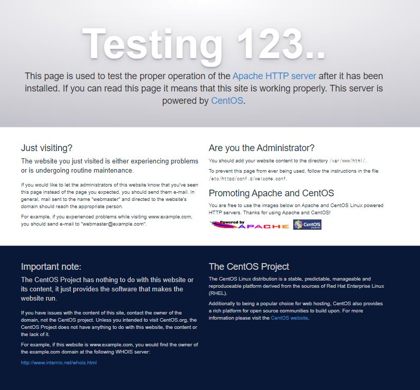

# Apache 설치하기

## 설치하기

```text
# yum install -y httpd-devel
```

## 방화벽 허용

```text
# firewall-cmd --permanent --zone=public --add-port=80/tcp
# firewall-cmd --reload
```

## 실행하

```text
# service httpd start
```

설치가 완료되면,  /var/www/html 폴더 안에 리소스 파일을 담아두고 사용하실 수 있습니다.  
별도로 다른 폴더도 공유하고 싶다면, /etc/httpd/conf/httpd.conf 파일을 찾아서 편집하실 수 있습니다.

예\) http://192.168.136.140

아래와 같은 화면이 뜬다면 성공한 것입니다.



